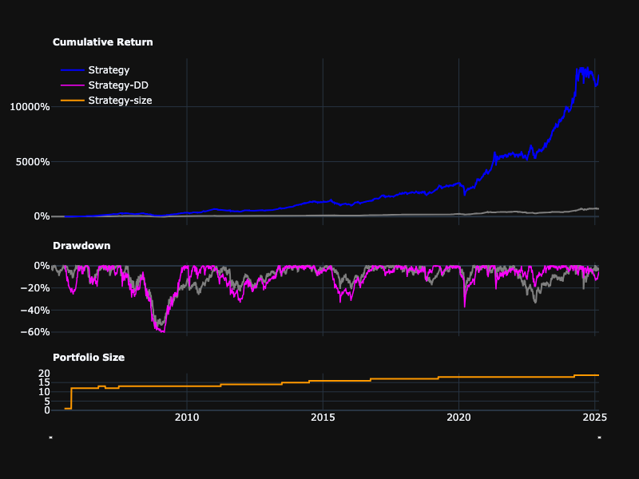
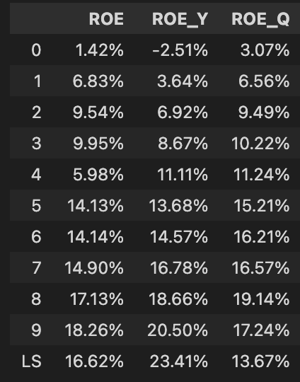
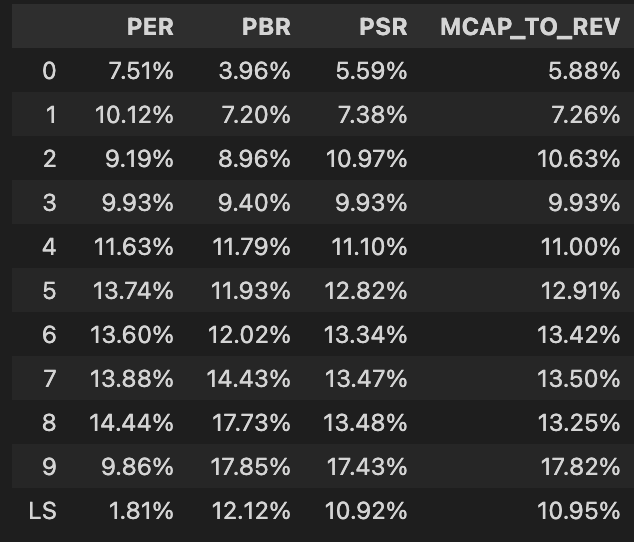
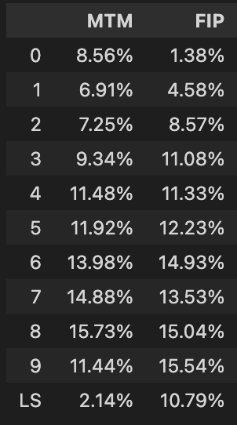
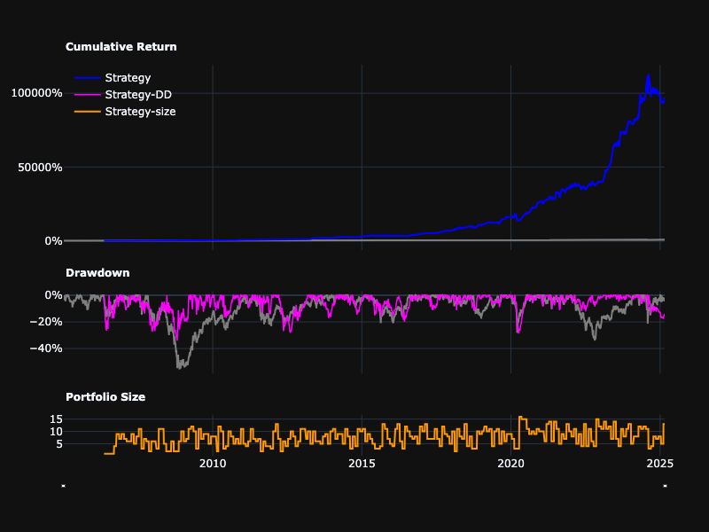
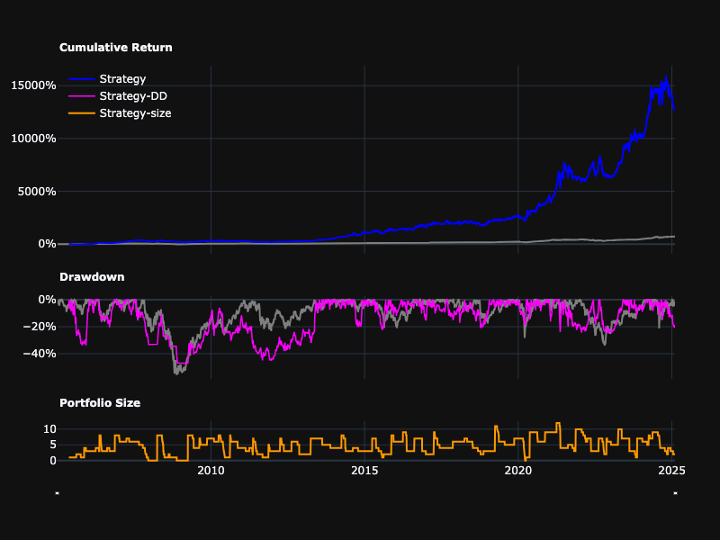

# 台灣三因子策略

基於葉怡成教授在台股研究室提出的三因子量化交易策略，並進行改良。

## 基礎策略

基礎策略使用三個基本的因子：
1. ROE
2. 過去3個月動能
3. 股價淨值比（越低越好）

這些因子最初由葉怡成教授在台股研究室提出，將其結合以創建綜合評分用於選股，每季度結束後再平衡。

```python
from quantdev.backtest import *

ROE = get_factor('常續ROE')
MTM = get_factor('mtm_3m')
PBR = get_factor('股價淨值比', asc=False)

classic_tw3factor = backtesting(
    get_factor(ROE+PBR+MTM)>=0.99, # 等權三因子
    rebalance='Q' # 每一季底再平衡 (使用最近一期的財報資料)
)
```

- Total Return: 12825.82%
- Annual Return: 27.29%
- MDD: -60.41%
- Annual Volatility: 20.21%
- Calmar Ratio: 0.45
- Sharpe Ratio: 1.4
- Beta: 0.61

```python
classic_tw3factor._plot_equity_curve()
```




經典的三因子策略已經可以取得優異的報酬，但仍然可以針對個別因子與參數進行更細緻的調整。

## 改進獲利因子

首先在 ROE 的部分，我們認為與其衡量 ROE 的絕對值，不如衡量 ROE 的變化率，我們進一步用因子分析來證實我們的猜想。

```python
profit_factors = {
    'ROE': get_factor('常續ROE'),
    'ROE_Y': get_data('常續ROE_yoy_diff'),
    'ROE_Q': get_data('常續ROE_qoq_diff'),
}

profit_quantiles = pd.DataFrame()
for k, v in profit_factors.items():
    profit_quantiles = pd.concat([
        profit_quantiles, 
        factor_analysis(v, rebalance='QR').summary_dfs['quantiles'].rename(columns={'Quantiles Returns':k})
        ], axis=1)
display(profit_quantiles)
```



由分析結果可見，ROE_Y 無論是前10百分位組或多空組合的的報酬率皆是最高，而 ROE_Q 的報酬率則更遜於 ROE，推測這是由於傳統台股具有淡旺季起伏，因此 QoQ 較無法體現 ROE 的變化，因此我們選擇 ROE_Y 作為新的獲利因子。

## 改進價值因子

普遍認知上 PBR 在台股的表現較佳，然而 PBR 的缺點是當股價下跌則可能導致 PBR 降低，變成 "越跌越買"，因此我們嘗試找到更好的價值衡量指標。

根據顧廣平教授於2005年的<單因子, 三因子或四因子模式?>，台股常見的價值因子包括

- 本益比 = 股價 / 每股盈餘
- 股價淨值比 = 股價 / 每股淨值
- 股價營收比 = 股價 / 每股營收
- 市值營收比 = 市值 / 營收

我們接著透過因子分析檢驗各指標的表現

```python
from quantdev.analysis import *

value_factors = {
    'PER':get_factor('本益比', asc=False),
    'PBR':get_factor('股價淨值比',asc=False),
    'PSR':get_factor(get_data('收盤價')/get_data('每股營業收入'),asc=False),
    'MCAP_TO_REV':get_factor(get_data('個股市值(元)')/get_data('營業收入'), asc=False),
}

value_quantiles = pd.DataFrame()

for k, v in value_factors.items():
    result = factor_analysis(v, rebalance='QR')
    value_performance = pd.concat([
        value_performance,
        result.summary_dfs['summary_metrics'].droplevel(0, axis=1)[['f_return']].rename(columns={'f_return':k})
    ], axis=1)
    value_ic = pd.concat([
        value_ic,
        result.summary_dfs['ic'].rename(columns={'Information Coefficient':k})
    ], axis=1)
    value_quantiles = pd.concat([
        value_quantiles, 
        result.summary_dfs['quantiles'].rename(columns={'Quantiles Returns':k})
        ], axis=1)
    
display(value_performance)
display(value_quantiles)
display(value_ic)
```



從報酬率的角度而言： PBR > MCAP_TO_REV > PSR > PER，儘管 PBR 在最高百分位與多空的報酬率都相對較高，但基於上述 PBR 的缺點，我們使用市值營收比作為新的價值因子。

## 改進動能因子

傳統的動能因子衡量股價過去一段時間的累計漲跌幅度，然而根據 <Frog in the Pan: Continuous Information and Momentum>，動能可以進一步區分為緩漲、暴漲，而較好的動能應該是每天漲一點點、漲幅有延續性，而不是瞬間暴漲。該文提出了新的計算動能的方式:

FIP = sgn(PRET) × ([%neg − %pos])

其中 sgn(PRET) 是過去一段時間股價變化是否為正，%neg 是股價下跌的天數佔比，%pos 是股價上漲的天數佔比。

然而根據 [改善價格動能策略的簡單辦法](https://vocus.cc/article/63e4568dfd89780001719499)，週轉率對於台股版 FIP 同樣重要，因此我們使用周轉率 + %pos 合成新的FIP因子。

```python
MTM = get_factor('mtm_3m')

returns = get_data('報酬率')
turnover = get_data('周轉率')
days = 20
FIP = get_factor(
    get_factor(
        returns.apply(lambda x: ((x>0).rolling(days).sum()))
    ) + 
    get_factor(turnover.rolling(days).mean(), asc=False)
)

mtm_quantiles = pd.concat([
        factor_analysis(MTM, rebalance='M').summary_dfs['quantiles'].rename(columns={'Quantiles Returns':'MTM'}),
        factor_analysis(FIP, rebalance='M').summary_dfs['quantiles'].rename(columns={'Quantiles Returns':'FIP'}),
    ], axis=1)
display(mtm_quantiles)
```


由回測結果可見，FIP 的報酬率較 MTM 更高，且波動較小，因此我們選擇 FIP 作為新的動能因子。

## 改進股票池和再平衡日期


我們進行了兩個關鍵調整以改進策略：

1. 選股範圍：
   - 增加獲利能力篩選（正淨利）
   - 增加技術面篩選（價格高於60日移動平均線）
   
   這些篩選有助於聚焦於財務更健康且具有正向價格動能的公司。

2. 再平衡時機：
   - 從季度（'Q'）改為季度財報發布日期（'QR'）
   - 確保我們使用最新的財務數據進行交易，而不是過時的資訊

結果顯示在保持類似風險指標的同時，績效有所提升（年化報酬率從22.79%提升至33.25%）。然而，較大的最大回撤仍然是一個需要在下一版本中解決的問題。

```python
universe = (get_data('稅後淨利')>=0) &\
    (get_data('收盤價')>=get_data('收盤價').rolling(60).mean())

roe = get_factor('roe', universe=universe)
mtm = get_factor('mtm_3m', universe=universe)
pbr = get_factor('股價淨值比', asc=False, universe=universe)
factor = get_factor(roe+mtm+pbr)

adjusted_tw3factor = backtesting(factor>=0.99, rebalance='QR')
adjusted_tw3factor.summary
```

- Annual return: 33.25%
- Total return: 33221.64%
- Max drawdown: -61.43%
- Annual volatility: 29.03%
- Sharpe ratio: 1.1
- Calmar ratio: 0.54
- Beta: 0.6

```python
adjusted_tw3factor._plot_equity_curve()
```



## 透過MAE/MFE分析收斂回撤
從MFE分布可以看出，虧損交易在75%百分位(Q3)的最大損失為15.16%，這意味著超過15.16%的損失大多是無法回復的。

```python
adjusted_tw3factor._plot_maemfe()
```


因此，我們可以在15%虧損時增加停損來改善策略。

```python
stop_lossed_tw3factor = backtesting(factor>=0.99, rebalance='QR', stop_loss=0.15, stop_at='intraday')
stop_lossed_tw3factor._plot_maemfe()
```


從GMFE/MAE可以看出，停損是有效的，最大損失從原來的40%減少到20%左右。

```python
stop_lossed_tw3factor.summary
```

- Annual return: 27.24%
- Total return: 12994.90%
- Max drawdown: -46.91%
- Annual volatility: 24.30%
- Sharpe ratio: 1.1
- Calmar ratio: 0.58
- Beta: 0.37

最大回撤從原本的61%降低至47%，年化報酬率則從33.25%略微下降至27.24%。

```python
stop_lossed_tw3factor._plot_equity_curve()
```




## 結論
| | 原始策略 | 改良策略 | 停損策略 |
|----------|---------------|--------------|--------------|
| Annual return | 22.79% | 33.25% | 27.24% |
| Total return | 6086.99% | 33221.64% | 12994.90% |
| Max drawdown | -58.24% | -61.43% | -46.91% |
| Annual volatility | 19.66% | 29.03% | 24.30% |
| Sharpe ratio | 1.20 | 1.10 | 1.10 |
| Calmar ratio | 0.39 | 0.54 | 0.58 |
| Beta | 0.57 | 0.60 | 0.37 |

本研究透過三個階段優化台股動能策略:
1. 原始策略使用簡單的價值/獲利/動能三因子，雖然有不錯的報酬但波動較大
2. 改良策略只納入獲利能力為正且收盤價在季線之上的股票，並使用財報發布日期再平衡，年化報酬率提升至33.25%，但最大回撤仍然較大
3. 最後加入15%停損機制，成功將最大回撤從61%降至47%，雖然年化報酬略為下降，但整體風險調整後報酬(卡瑪比率)反而提升

整體而言，最終版本的策略在風險與報酬上都有明顯改善。

