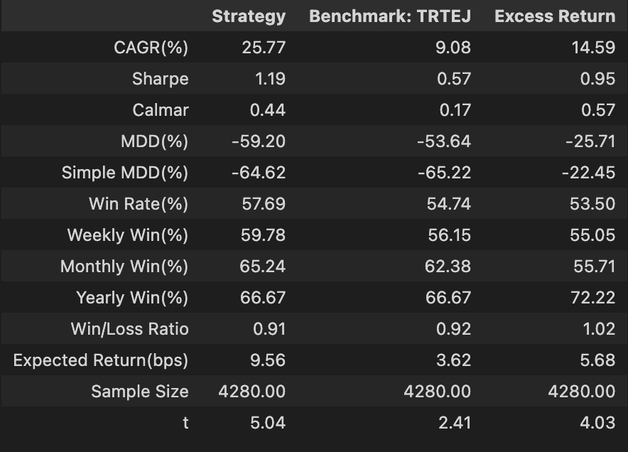
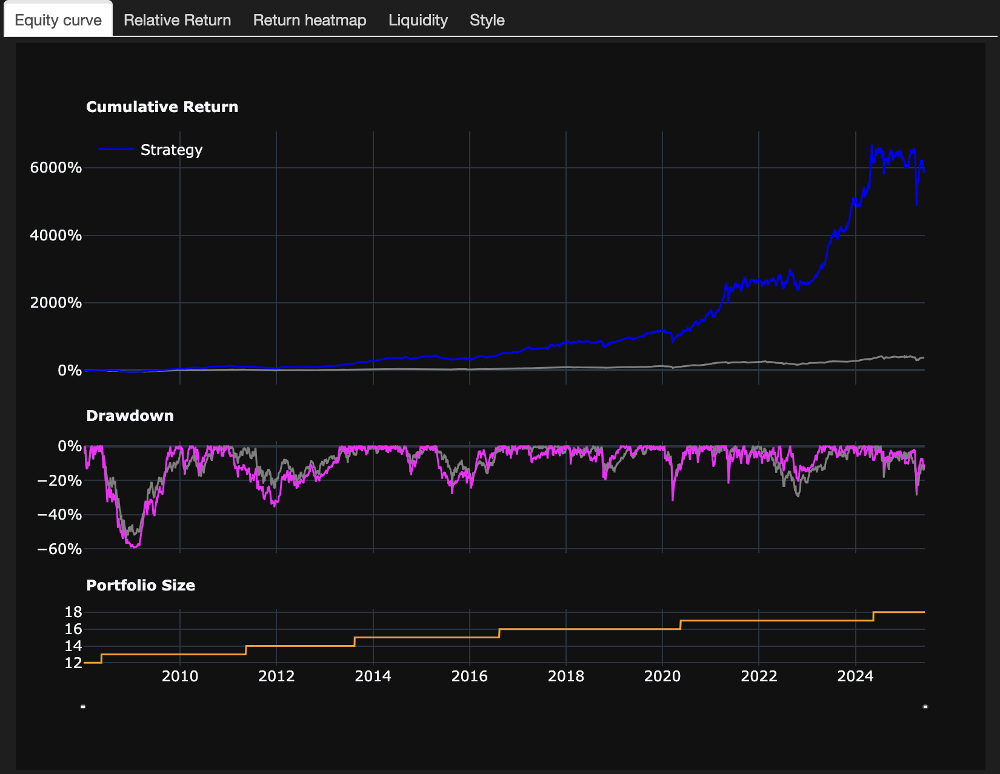
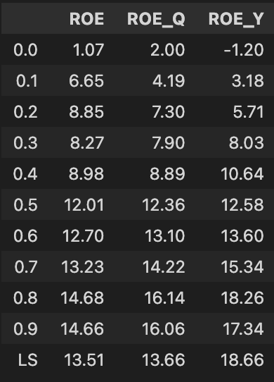
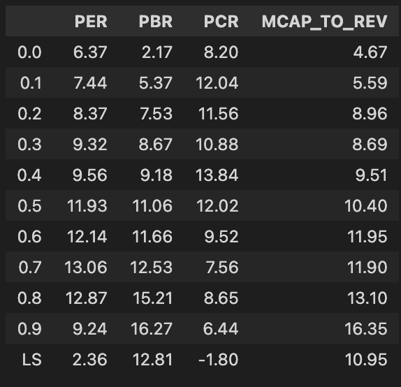
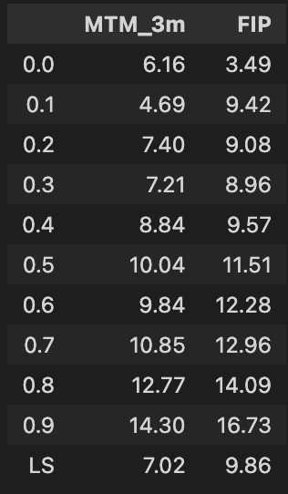
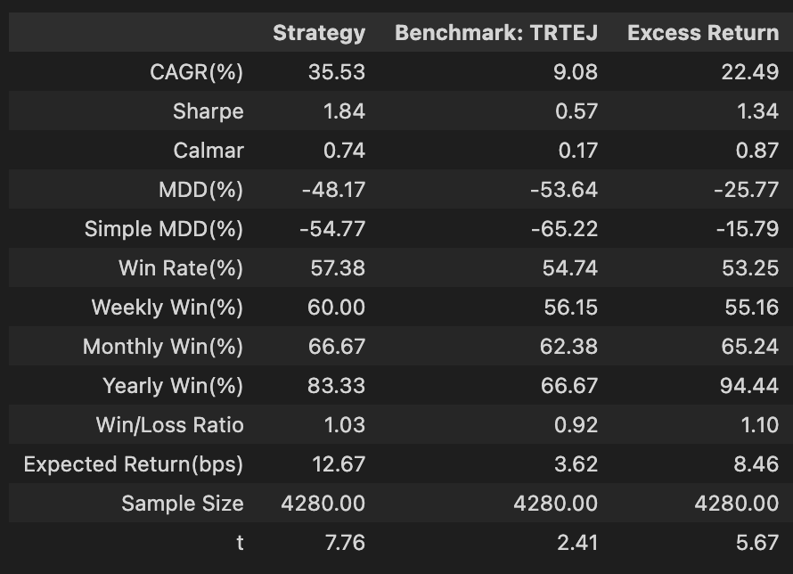
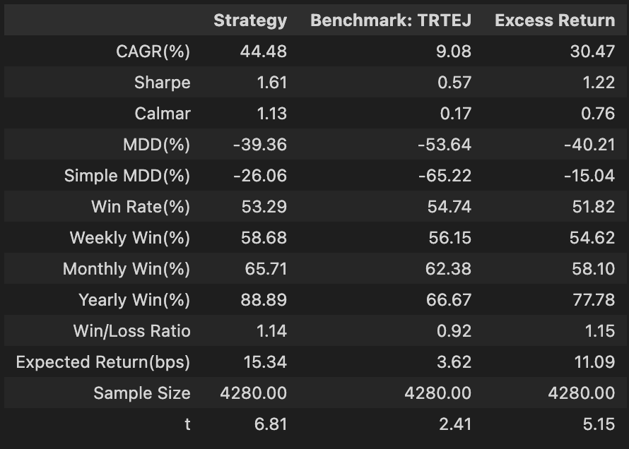
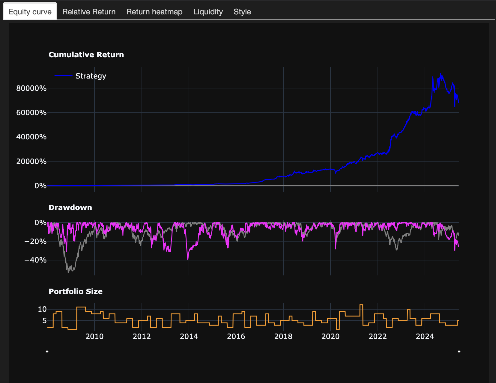

# 台灣三因子策略

本研究基於葉怡成教授於【台股研究室】提出的台股三因子量化交易策略，透過因子層面與策略層面的優化，大幅提升策略績效。

## 基礎策略

基礎策略使用三個基本的因子：
1. 獲利因子 - ROE
2. 價值因子 - 股價淨值比
3. 動能因子 - 過去3個月漲幅

原始策略採用季度再平衡，基礎實作如下：

```python
from quantdev.backtest import *

ROE = (data['常續ROE']).to_factor()
PBR = (-1*data['股價淨值比']).to_factor()
MTM = (data['收盤價']*data['調整係數']).pct_change(60).to_factor()
classic_tw3factor = backtesting(
    (ROE+PBR+MTM).to_rank()>=0.99, # 等權三因子, 並選前 1% 投資
    rebalance='QR', # 每一季底再平衡 (使用最近一期的財報資料)
    start='2008',
    report=True,
)
```


```python
classic_tw3factor.tabs
```




經典的三因子策略已經可以取得優異的報酬，但仍然可以針對個別因子與參數進行更細緻的調整。

## 因子優化

### 獲利因子

我們提出假設：ROE的變化率可能比其絕對值更具預測性。為驗證這點，我們比較了三種獲利指標：
- ROE（原始值）
- ROE_Y（年增率）
- ROE_Q（季增率）

```python
from quantdev.analysis import *

profit_factors = {
    'ROE': data['常續ROE'],
    'ROE_Q': (data['常續ROE'] - data['常續ROE_Lag1']),
    'ROE_Y': (data['常續ROE'] - data['常續ROE_Lag4']),
}

profit_quantiles = pd.concat(
    [
        calc_metrics(pd.DataFrame(calc_factor_quantiles_return(v.to_rank(), rebalance='QR', start='2008', add_ls=True)))\
            .loc['CAGR(%)']\
            .rename(k) 
            for k, v in profit_factors.items()
    ], 
    axis=1
)
display(profit_quantiles)
```



由分析結果可見，ROE_Y 無論是前10百分位組或多空組合的的報酬率皆是最高，而 ROE_Q 的報酬率則更遜於 ROE，推測這是由於傳統台股具有淡旺季起伏，因此 QoQ 較無法體現 ROE 的變化，因此我們選擇 ROE_Y 作為新的獲利因子。

### 價值因子

傳統使用的PBR雖然表現不錯，然而其缺點是當股價下跌則可能導致 PBR 降低，變成 "越跌越買"，因此我們參考顧廣平教授的《單因子, 三因子或四因子模式?》，嘗試比較四種常見的價值因子：

- 本益比 = 股價 / 每股盈餘
- 股價淨值比 = 股價 / 每股淨值
- 股價營收比 = 股價 / 每股營收
- 市值營收比 = 市值 / 營收

```python
value_factors = {
    'PER':(data['本益比']*-1),
    'PBR':(data['股價淨值比']*-1),
    'PCR':(data['收盤價']/data['營運產生現金流量']*-1),
    'MCAP_TO_REV':(data['個股市值(元)']/data['營業收入']*-1),
}

value_quantiles = pd.concat(
    [
        calc_metrics(pd.DataFrame(calc_factor_quantiles_return(v.to_rank(), rebalance='QR', start='2008', add_ls=True)))\
            .loc['CAGR(%)']\
            .rename(k) 
            for k, v in value_factors.items()
    ], 
    axis=1
)
display(value_quantiles)
```


雖然PBR的表現最佳，但考慮前面提到的固有缺陷，我們選擇表現次佳且更穩健的市值營收比作為新的價值因子。

### 動能因子

傳統的動能因子衡量股價過去一段時間的累計漲跌幅度，然而根據《Frog in the Pan: Continuous Information and Momentum》，動能可以進一步區分為緩漲、暴漲，而較好的動能應該是每天漲一點點、漲幅有延續性，而不是瞬間暴漲。該文提出了新的計算動能的方式:

FIP = sgn(PRET) × ([%neg − %pos])

其中 sgn(PRET) 是過去一段時間股價變化是否為正，%neg 是股價下跌的天數佔比，%pos 是股價上漲的天數佔比。

與此同時，[改善價格動能策略的簡單辦法](https://vocus.cc/article/63e4568dfd89780001719499) 認為週轉率對於台股的 FIP 同樣重要，因此我們使用周轉率 + %pos 合成新的FIP因子。

```python
MTM = get_factor('mtm_3m')

returns = get_data('報酬率')
turnover = get_data('周轉率')
days = 20
FIP = get_factor(
    get_factor(
        returns.apply(lambda x: ((x>0).rolling(days).sum()))
    ) + 
    get_factor(turnover.rolling(days).mean(), asc=False)
)

mtm_quantiles = pd.concat([
        factor_analysis(MTM, rebalance='M').summary_dfs['quantiles'].rename(columns={'Quantiles Returns':'MTM'}),
        factor_analysis(FIP, rebalance='M').summary_dfs['quantiles'].rename(columns={'Quantiles Returns':'FIP'}),
    ], axis=1)
display(mtm_quantiles)
```


由回測結果可見，FIP 的報酬率較 MTM 更高，且波動較小，因此我們選擇 FIP 作為新的動能因子。

## 參數優化

我們將更新後的因子進行組合並回測
```python
ROE_Y = (data['常續ROE']-data['常續ROE_lag4']).to_rank()
MCAP_TO_REV = (data['個股市值(元)']/data['營業收入']*-1).to_rank()
FIP = (
    returns.apply(lambda x: ((x>0).rolling(days).sum())).to_factor() -
    turnover.rolling(days).mean().to_factor()
).to_rank()
TW3F = (ROE_Y+MCAP_TO_REV+FIP).to_rank()
tw3f_report2 = backtesting(
   TW3F>=0.99, # 等權三因子
   rebalance='QR', 
   start=2008,
   report=True, 
)
```



由圖可見，改進後的策略在年化報酬率、MDD、波動度上都有所提升，然而，在選股池上，我們仍可以參考《雙動能投資：高報酬低風險策略》，基於絕對動能 (個股自身過去的漲幅) 的概念，只投資在均線之上的股票。

```python
close = data['收盤價']
TW3F = (ROE_Y+MCAP_TO_REV+FIP).to_rank(universe=(close>=close.rolling(60).mean()))
tw3f_report3 = backtesting(
   TW3F>=0.99, # 等權三因子
   rebalance='QR', 
   start=2008,
   report=True, 
)
```


```python
improved_tw3factor2.tabs
```



## 結論
本研究透過兩個階段優化台股三因子策略:
1. 改良策略使用ROE年增率/市值營收比/FIP因子，將年化報酬提升至35.53%，最大回撤降至48.17%
2. 最終策略限制只投資在月線之上的股票，成功將年化報酬提升至44.48%，最大回撤降至39.36%，顯示策略的穩健性提高

| | 原始策略 | 改良因子策略 | 最終策略 |
|----------|---------------|--------------|--------------|
| CAGR(%) | 25.77 | 35.53 | 44.48 |
| Sharpe | 1.19 | 1.84 | 1.61 |
| Calmar | 0.44 | 0.74 | 1.13 |
| MDD(%) | -59.20 | -48.17 | -39.36 |
| Simple MDD(%) | -64.62 | -54.77 | -26.06 |
| Win Rate(%) | 57.69 | 57.38 | 53.29 |
| Weekly Win(%) | 59.78 | 60.00 | 58.68 |
| Monthly Win(%) | 65.24 | 66.67 | 65.71 |
| Yearly Win(%) | 66.67 | 83.33 | 88.89 |
| Win/Loss Ratio | 0.91 | 1.03 | 1.14 |
| Expected Return(bps) | 9.56 | 12.67 | 15.34 |
| Sample Size | 4280.00 | 4280.00 | 4280.00 |
| t | 5.04 | 7.76 | 6.81 |

整體而言，最終版本的策略在風險與報酬上都有明顯改善。

## 附錄: 回測假設
1. 回測期間: 2008/01/01 ~ 2025/06/05
2. 交易成本: 含税、手續費以三折計算、滑價以 1‰ 計
3. 比較基準: 加權指數含息報酬 
4. 再平衡時間點: 法定財報公布截止日的下一個交易日
5. 資料來源: TEJ
