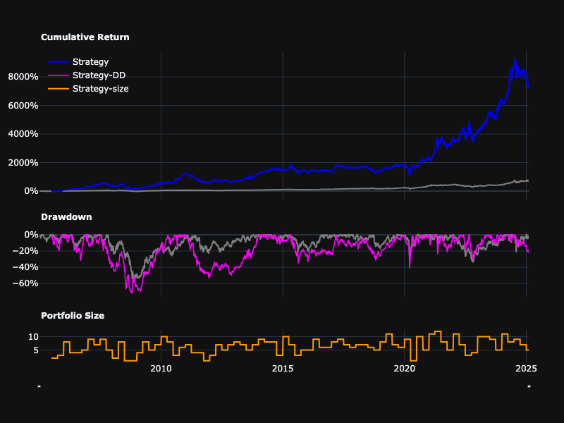
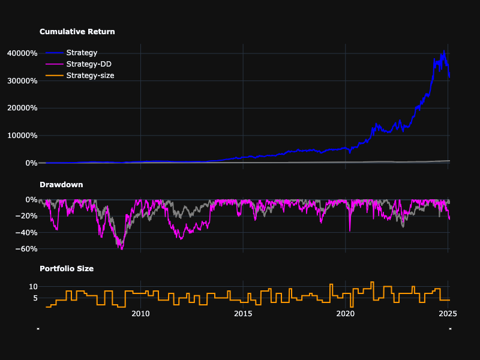
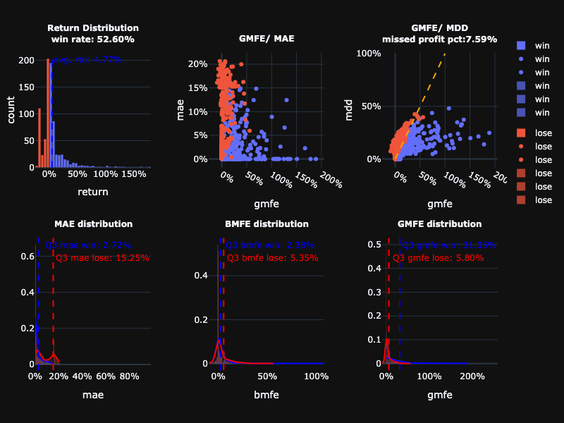

# 台灣三因子模型

[English](README_EN.md)

基於台股研究室葉怡成教授提出的三因子量化交易策略，並進行漸進式改良。

## 基礎策略

基礎策略使用三個基本面因子：
1. ROE（股東權益報酬率）
2. 3個月動能
3. 股價淨值比（反向）

這些因子最初由台股研究室的葉怡成教授提出，將其結合以創建綜合評分用於選股，每季度再平衡。

```python
roe = bts.get_factor('roe')
mtm = bts.get_factor('mtm_3m')
pbr = bts.get_factor('股價淨值比', asc=False)
factor = bts.get_factor(roe+mtm+pbr)

tw3factor = bts.backtesting(factor>=0.99, rebalance='Q')
tw3factor.summary
```
- Annual Return: 24.07%
- Total Return: 7525.18%
- Max Drawdown: -72.55%
- Annual Volatility: 28.59%
- Sharpe Ratio: 0.84
- Calmar Ratio: 0.33
- Beta: 0.59

```python
tw3factor._plot_equity_curve()
```




## 改進股票池和再平衡日期

我們進行了兩個關鍵調整以改進策略：

1. 選股範圍：
   - 增加獲利能力篩選（正淨利）
   - 增加技術面篩選（價格高於60日移動平均線）
   
   這些篩選有助於聚焦於財務更健康且具有正向價格動能的公司。

2. 再平衡時機：
   - 從季度（'Q'）改為季度財報發布日期（'QR'）
   - 確保我們使用最新的財務數據進行交易，而不是過時的資訊

結果顯示在保持類似風險指標的同時，績效有所提升（年化報酬率從22.79%提升至33.25%）。然而，較大的最大回撤仍然是一個需要在下一版本中解決的問題。

```python
universe = (bts.get_data('稅後淨利')>=0) &\
    (bts.get_data('收盤價')>=bts.get_data('收盤價').rolling(60).mean())

roe = bts.get_factor('roe', universe=universe)
mtm = bts.get_factor('mtm_3m', universe=universe)
pbr = bts.get_factor('股價淨值比', asc=False, universe=universe)
factor = bts.get_factor(roe+mtm+pbr)

adjusted_tw3factor = bts.backtesting(factor>=0.99, rebalance='QR')
adjusted_tw3factor.summary
```

- Annual return: 33.25%
- Total return: 33221.64%
- Max drawdown: -61.43%
- Annual volatility: 29.03%
- Sharpe ratio: 1.1
- Calmar ratio: 0.54
- Beta: 0.6

```python
adjusted_tw3factor._plot_equity_curve()
```



## 透過MAE/MFE分析收斂回撤
從MFE分布可以看出，虧損交易在75%百分位(Q3)的最大損失為15.16%，這意味著超過15.16%的損失大多是無法回復的。

```python
adjusted_tw3factor._plot_maemfe()
```


因此，我們可以在15%虧損時增加停損來改善策略。

```python
stop_lossed_tw3factor = bts.backtesting(factor>=0.99, rebalance='QR', stop_loss=0.15, stop_at='intraday')
stop_lossed_tw3factor._plot_maemfe()
```



從GMFE/MAE可以看出，停損是有效的，最大損失從原來的40%減少到20%左右。

```python
stop_lossed_tw3factor.summary
```

- Annual return: 27.24%
- Total return: 12994.90%
- Max drawdown: -46.91%
- Annual volatility: 24.30%
- Sharpe ratio: 1.1
- Calmar ratio: 0.58
- Beta: 0.37

最大回撤從原本的61%降低至47%，年化報酬率則從33.25%略微下降至27.24%。

```python
stop_lossed_tw3factor._plot_equity_curve()
```


